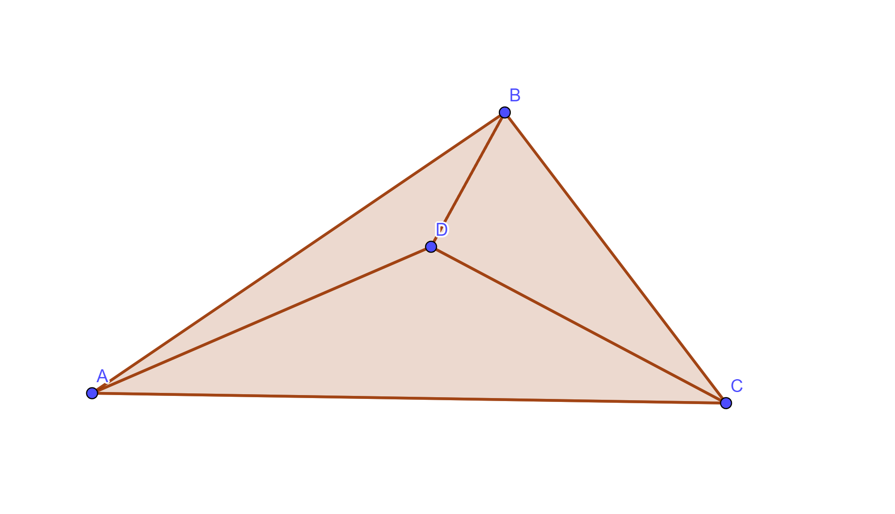

# Random Questions and Answers

Totally random and unsolicited questions + answers

---

## How many possible substrings are there in a string of length n?

**Answer**:

$$
1 + 2 + ... + n = \frac{n(n+1)}{2}
$$

Quick visualization here:

Consider string `s = "abcde"` with length of 5

```
For substrings of
length 1:
  |a|bcde, a|b|cde, ab|c|de, abc|d|e, abcd|e| (n of them)

lenght 2:
  |ab|cde, a|bc|de, ab|cd|e, abc|de| (n-1 of them)

length 3:
  |abc|de, a|bcd|e, ab|cde| (n-2 of them)

...

length 5:
  |abcde| (1 of them)

```

---

## How did we get the formula for sum of numbers from 1 to n?

Basically that popular story about Gauss in elementary school

Look at $1 + 2 + ... + (n-1) + n$

Then consider the reverse, i.e. $n + (n-1) + ... + 2 + 1$

If we pair up the terms, we get $(n+1) + (n+1) + ... + (n+1) + (n+1)$. Basically $n+1$ added up $n$ times

So the sum of $1 + 2 + ... + n$ *doubled* is $n(n+1)$

Thus $1 + 2 + ... + n = \frac{n(n+1)}{2}$

---

## How to quickly tell if two circles are overlapping?

2 circles are overlapping if the distance between their centers is strictly less than the sum of their radii

---

## How to tell if a point lies within a triangle given triangle vertices?

(This is a bit sus, maybe there's a better idea)



Basically if $D$ is in $\triangle{ABC}$, then $[ABC] = [ADB] + [ADC] + [BDC]$
- note $[ABC]$ = area of $\triangle{ABC}$